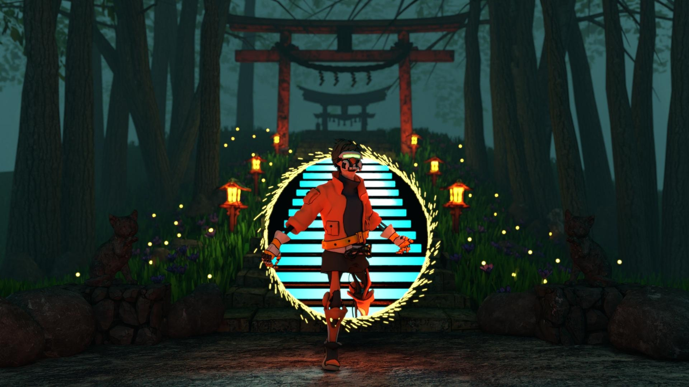
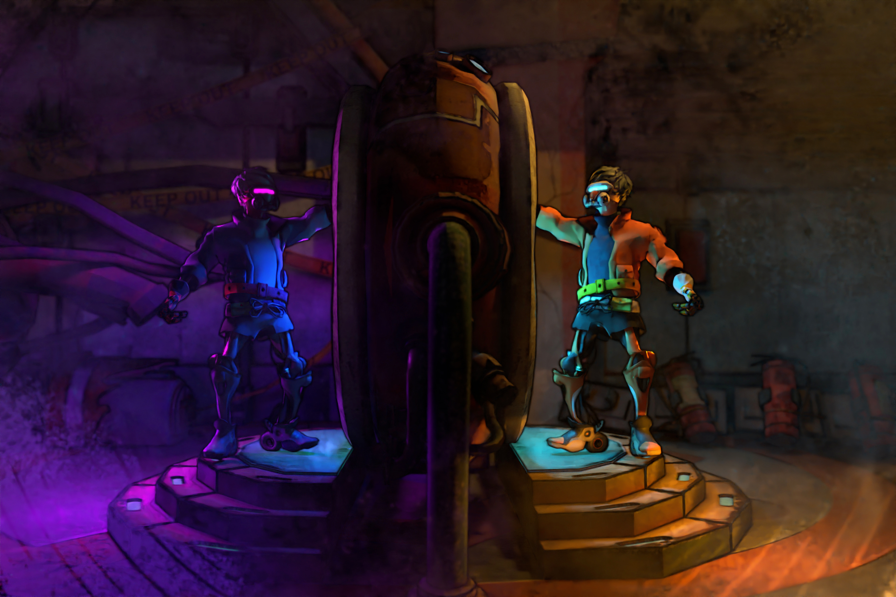

# Charlotte Renderer - CPU Path Tracer Implementation

A **CPU-based path tracer** developed for the Computer Graphics course (Winter Semester 2023/2024). This renderer showcases various modern rendering techniques implemented from scratch for non-photorealistic rendering result. We extend the renderer capabilities to support for features required to render the final image.

<!-- --- -->

## Features

This path tracer supports the following features:

- Line Tracer
- Normal Mapping
- Alpha Masking
- Area Light
- Thin Lens Camera
- Bloom Effect
- Halton Sampler
- Image Denoising
- Fog Effect

<!-- --- -->

## Renderer Result

Below are results of the rendered scenes for submission on the rendering competition:

| Rendering Result 1 (Yudz) | Rendering Result 2 (Gillian) |
|-----------------|-----------------|
|  |  |

More desciption about the rendering result, features, and challenges can be found [here](YOUR_WEBSITE_LINK_HERE)

<!-- --- -->


## Build Instructions

Building the path tracer is straightforward using CMake:

```bash
# Create build directory
mkdir build 

# Generate build files and compile the project
cmake -B build -S . && cmake --build build
```

## Run Instructions


The visualization of the rendering requires the utilization of [tev by Tom94](https://github.com/Tom94/tev) where the result will be directly streamed into the application. To run all the test cases, simply perform the following test:

```bash
# Run samples (make sure tev window is open)
python run_tests.py
```